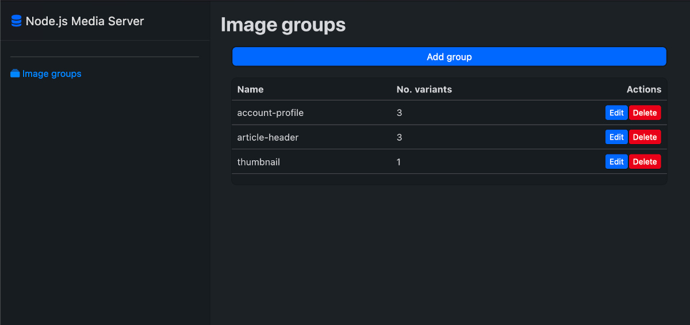
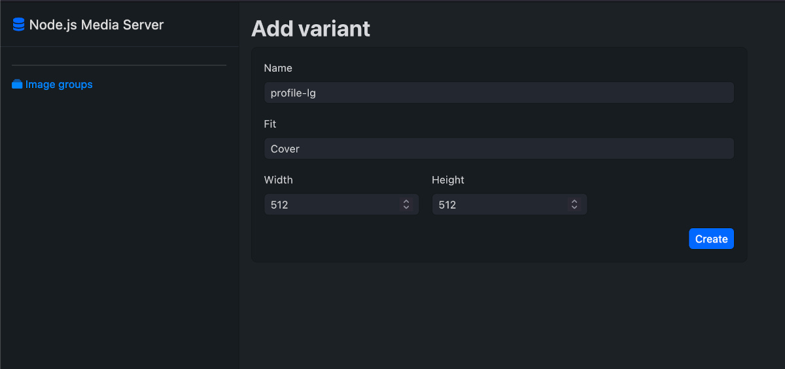
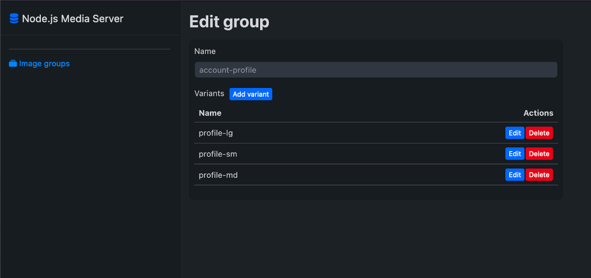

# Node Media Server

**This standalone service has all features needed to store, resize and optimize images for later delivery.**

> [!WARNING]
> This is hobby project, **_not intended to use in production environment!_** If you need similar solution, look at some battle-tested products like ImageProxy.

## Core features

- Create image groups and variants containing custom image transformations.
- Upload and store images, assign them to image groups.
- Serve transformed images in formats optimized for delivery.

## Core tech stack


## Dashboard

Production service is shipped with angular dashboard allowing to easily edit image groups and variants

</img>
</img>
</img>

## Deployment

Project includes Dockerfile to build service image and sample docker-compose.yaml to easily run service with mongodb database.

To build docker image, run command from root package level:

```
npm run build:image
```

## Future work

- Add storage adapter for S3 compatible object storage
- Add support for videos
